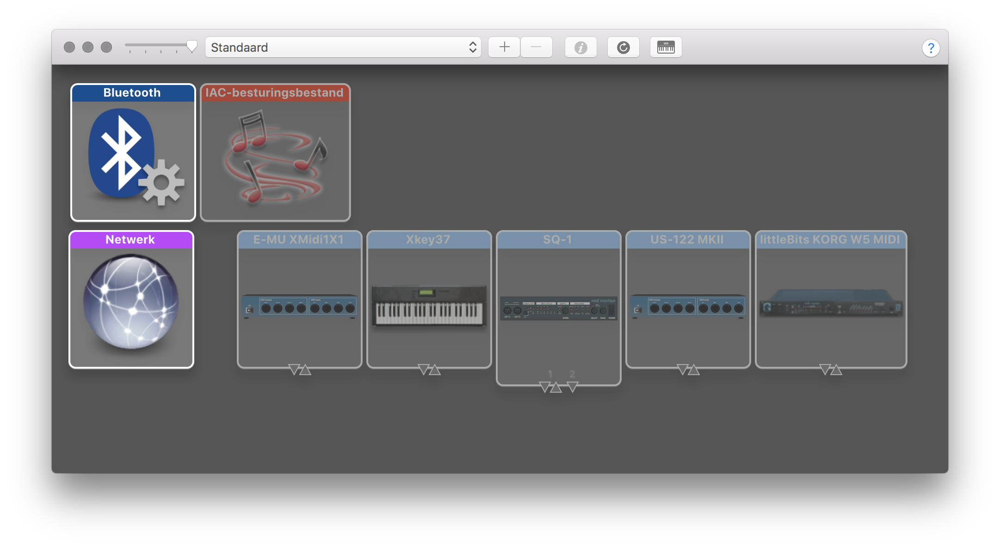

# MIDI

Series of sketches for visualising MIDI input.

MIDI (Musical Instrument Digital Interface) https://en.wikipedia.org/wiki/MIDI is a standard for connecting electronic music devices to each other. Using a MIDI connection, you can connect keyboards, sequencers, drum machines, DAW applications to your computer.

MIDI for the web browser is only supported by Chrome and Opera at the time of writing.

When using MacOS, you can check and manage the connection status of MIDI devices with the Audio/MIDI Configuration tool. By clicking the keyboard-shaped icon in the toolbar you can hear incoming signals if a device is connected.

